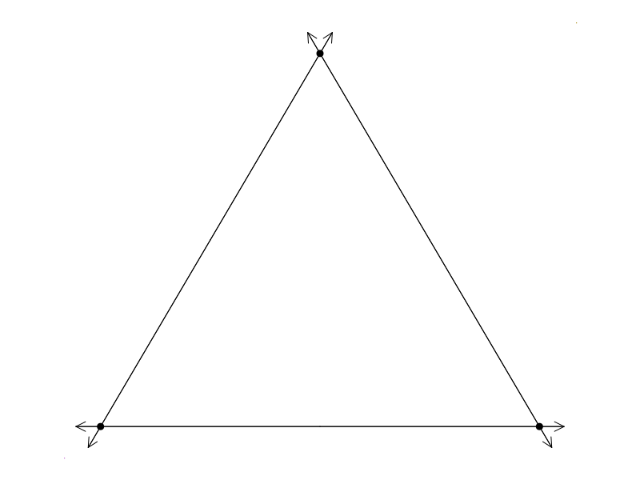

# RationalProjectivePlane

Points and lines in the rational projective plane. Both are represented using homogenous coordinates. 

> Homogenous coordinates are triples of rational numbers that are not all zero. The triple `(a ,b, c)` is the same as the triple `(ma, mb, mc)` where `m` is any nonzero rational. 

## Creating points and lines

A point in the projective plane is created by one of the following methods:
* `PPoint(a,b,c)` where `a`, `b`, and `c` are rational numbers that are not all zero.
* `PPoint(a,b)` is the same as `PPoint(a,b,1)`.
* `PPoint([a,b,c])` or `PPoint([a,b])`.

Likewise, lines are created with `PLine`.

Points are printed as triples `(a,b,c)` where `a`, `b`, and `c` are relatively prime integers.

Similarly, lines are printed as `[a,b,c]`.

```
julia> PPoint(2, 3//5, 1)
(10 : 3 : 5)

julia> PPoint(2,-2)
(2 : -2 : 1)

julia> PLine(2,4,6)
[1 : 2 : 3]

julia> PLine(2,2)
[2 : 2 : 1]
```

Note that `PPoint(0,0,0)` and `PLine(0,0,0)` throw errors. 

### Conversion between points and lines

Points and lines are not the same, but it is possible to convert a point to a line 
(and vice versa). For a point `a`, use `PLine(a)` to create a line with the same
homogenous coordinates as `a`. Conversely, for a line `L` use `PPoint(L)` to create a
point with the same homogenous coordinates as `L`.

```
julia> a = PPoint(2,3,-1)
(-2 : -3 : 1)

julia> L = PLine(2,3,-1)
[-2 : -3 : 1]

julia> a == L
false

julia> a == PPoint(L)
true

julia> PLine(a)
[-2 : -3 : 1]
```

### Conversion to a `Vector`

Given a point or line, `x`, use `Vector(x)` to convert `x` into a vector of integers. 
The vector version is scaled such that the last nonzero coordinate is positive and the
greatest common divisior of the components is `1`.
```
julia> a = PPoint(-3, 3//2, 5);

julia> Vector(a)
3-element Vector{Int64}:
 -6
  3
 10
```


## Incidence

Any of the following may be used to see if a point `a` is on a line `L`:
* `in(a,L)`
* `a in L`
* `a ∈ L`
* `L ∋ a`

> The symbol `∈` can is typed `\in<tab>` and the symbol `∋` is typed `\ni<tab>`.

```
julia> a = PPoint(2,1,1)
(2 : 1 : 1)

julia> L = PLine(-1,1,1)
[-1 : 1 : 1]

julia> a ∈ L
true
```

To check if points are collinear, use `collinear` and to check if lines are concurrent (all 
contain the same point), use `concurrent`. These can be used either on comma-separated 
arguments or on a `Vector` of arguments.
```
julia> a = PPoint(2,5,10)
(2 : 5 : 10)

julia> b = PPoint(1,1,1)
(1 : 1 : 1)

julia> c = PPoint(3,6,11)
(3 : 6 : 11)

julia> collinear(a,b,c)
true

julia> a ∨ b == a ∨ c
true
```


## Operations

Given distinct points `a` and `b`, use `a ∨ b` to give the unique line that contains
both points.

Given distinct lines `L` and `M`, use `L ∧ M` to give the unique point that lines 
on both lines. 

> The symbol `∨` is typed `\vee<tab>` and the symbol `∧` is typed `\wedge<tab>`.


```
julia> a = PPoint(2,3,5)
(2 : 3 : 5)

julia> b = PPoint(-1,-4,2)
(-1 : -4 : 2)

julia> L = a ∨ b
[-26 : 9 : 5]

julia> a ∈ L
true

julia> b ∈ L
true
```


Given a single point `a`, `two_lines(a)` returns a pair of distinct lines that both
contain the point `a`

Given a singe line `L`, `two_points(L)` returns a pair of distince points that are
both on the line `L`.

```
julia> L = PLine(2, 3//5, -1)
[-10 : -3 : 5]

julia> a,b = two_points(L)
((-1 : 5 : 1), (1 : 0 : 2))

julia> a ∨ b
[-10 : -3 : 5]
```

## Infinity

The function `isinf` is used to tell if a point lies on the line at infinity as well
as checking if a line is the line at infinity. 
```
julia> a = PPoint(1,2,3)
(1 : 2 : 3)

julia> isinf(a)
false

julia> b = PPoint(1,2,0)
(1 : 2 : 0)

julia> isinf(b)
true
```

## Transformation

Given an invertible 3x3 matrix `M` (with integer or rational entries) and a point `p`, 
then `M*p` transforms the point `p` to a new point by applying `M` to `p`'s coordinates.

```
julia> M = [7 -7 -4; 9 -8 0; 6 2 9]
3×3 Matrix{Int64}:
 7  -7  -4
 9  -8   0
 6   2   9

julia> x = PPoint(5,6,-4)
(-5 : -6 : 4)

julia> y = PPoint(2,0,-5)
(-2 : 0 : 5)

julia> xx = M*x
(3 : -1 : 2)

julia> yy = M*y
(-34 : -18 : 33)
```

When a matrix `M` is applied to line `L`, however, the result is as if we applied the 
transformation to all of the points on `L`. *This is not the same as multiplying `M` 
with `L`'s coordinates.*

```
julia> L = x ∨ y
[30 : -17 : 12]

julia> LL = M*L
[-3 : 167 : 88]

julia> xx ∈ LL
true

julia> p = PPoint(L)
(30 : -17 : 12)

julia> M*p          # note that the answer is not [-3 : 167 : 88]
(281 : 406 : 254)  
```


## Cartesian Coordinates

If `p` is a point that is not at infinity, then it corresponds to a "normal" 
point in the Euclidean plane. The function `cartesian` gives the coordinates of
that point. That is, `cartesian(p)` returns a vector `[x,y]` with the property
that `p == PPoint(x,y,1)`.

```
julia> a = PPoint(5, -2, -15)
(-5 : 2 : 15)

julia> cartesian(a)
2-element Vector{Rational{Int64}}:
 -1//3
  2//15
  
julia> b = PPoint(3,-5,0)
(-3 : 5 : 0)

julia> cartesian(b)
ERROR: ArgumentError: The point (-3 : 5 : 0) is at infinity
```

A projective line `L` can be converted into a `Line` object (from the `Clines` module)
simply by using `Line(L)`. However, if `L` is the line at infinity, `nothing` is returned.
```
julia> using Clines

julia> L = PLine(12,18,3)
[4 : 6 : 1]

julia> Line(L)
Line(-1.0 + 0.5im, -0.25 + 0.0im)

julia> L = PLine(0,0,1)
[0 : 0 : 1]

julia> isinf(L)
true

julia> Line(L)   # returns nothing

julia> 
```


## Visualization

Together with `SimpleDrawing` (and `Plots`) projective points and lines can be 
drawn on the screen. For example:

```
newdraw()
a = PPoint(0, 0)
b = PPoint(2, 0)
c = PPoint(1, 17 // 10)
draw([a, b, c, a ∨ b, a ∨ c, b ∨ c])
```

This is the result:



Note that points or lines at infinity are never drawn. Lines are drawn using the 
`draw` method in `Clines`.